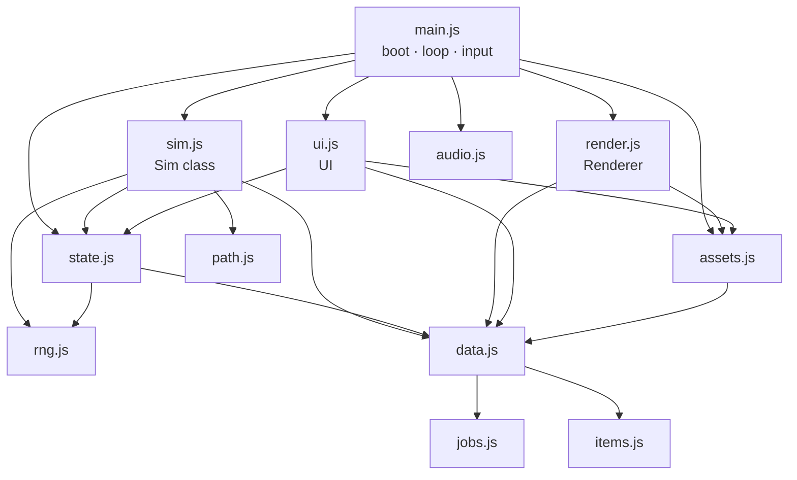

# Architecture

How the game is put together, which function owns what, and the invariants to keep. Pair this with
[RECIPES.md](RECIPES.md) (step-by-step changes) and [../AGENTS.md](../AGENTS.md) (rules).

## 1. Module map

Dependency order (also the bundle order in `tools/bundle.py`):
`rng → path → jobs → items → data → state → sim → assets → render → audio → ui → main`.

## 2. Boot and loop (`main.js`)

1. `boot()` waits for the pixel font, then `loadAll()` loads every image (atlas first, single files as fallback).
2. `load()` restores a save (or `newGame()`); `new Sim(s, hooks)`; `new Renderer(canvas)`; `new UI(game)`.
   `window.__game` exposes `{ s, sim, rnd, ui, audio }` for debugging and tests.
3. The Start button unlocks audio (browsers require a click) and starts the town music.
4. `frame(now)` every animation frame:
   - fixed-step accumulator: `acc += dt * speed`; run `sim.step()` while `acc >= DT` (0.1 s), **max 40 steps per frame**
     (prevents a spiral after the tab was hidden);
   - camera follow, `rnd.draw(...)`, `ui.tick()` every 0.25 s, autosave when the in-game week changes,
     music choice (boss/cave/battle near the active quest, night, seasonal town theme).
5. Input: pointer drag = pan, wheel/pinch/+/- = zoom (integer 1–6), tap = select or place, WASD/arrows = pan,
   Space = pause, 1/2/3 = speed. Road and Remove tools paint while dragging.

## 3. Game state (`s`) — plain JSON, saved as-is

| Field | Meaning |
|---|---|
| `schema, seed, tick, nextId` | save version · RNG state (mutated by `rng.js`) · step counter · id allocator |
| `time {week, month, year, t}` | calendar; `t` = seconds into the week |
| `gold, tp, pop, stars` | money · Town Points · popularity (float) · village rank 0–5 |
| `mats {wood, hide, herb, ore, crystal}` | village materials (monster drops) used to develop gear |
| `town {x0,y0,x1,y1}` | buildable rectangle (grows with the Expand event) |
| `ground` (string), `roads` (string of '0'/'1'), `props[]` | terrain detail per cell · road flags · trees/rocks/cave `{k,x,y,w,block,soft?}` |
| `buildings[]` | `{id, type, x, y, lv, sales, visits, occ[], v?}` — `type` is a key of `FAC` or `DECOR` |
| `advs[]` | adventurers (below) |
| `mons[]` | wild/quest monsters `{id, type|boss, zone, lv, x, y, hp, mhp, atk, def, target, quest?, ...}` |
| `monsters[]` | befriended village monsters `{id, type, name, bond, x, y, riding?}` |
| `folk[]`, `animals[]` | ambient townsfolk (spend small change) and farm animals |
| `unlocked {itemId:true}` | gear the shops can sell |
| `quests[]`, `quest` | quest board and the one active quest `{kind: outbreak|boss|dungeon, zone, members[], spot, mobs[], floor...}` |
| `cleared, bossesBeaten {id:true}` | progression counters |
| `titles {id:true}`, `traits {Name:n}` | earned titles · town trait totals (recomputed, safe to drop) |
| `events [{id, weeks}]` | running timed events |
| `log[]` | last 60 ticker messages `{text, kind, t}` |
| `stats` | income this/last month, upkeep, kills, visitors |
| `fx[]` | transient effects — **cleared on save**, never rely on them |

Adventurer (`makeAdventurer` in `state.js`):
`id, name, job, spr (sprite sheet name), lv, xp, jobLv {job: level}, jobXp, base {hp,atk,def,mag}, hp, gold, sat (satisfaction),
work, hunger, energy, fun, persona [PERSONA keys], resident, home (building id), partner (monster id), eq {weapon, armor, acc},
perks [PERKS keys], potions, x, y, dir (0 down,1 up,2 left,3 right), path, task, inside, dungeon, ko, stay, days, kills` + animation fields.

**Stat formula** (`stat(a, k, s)` in `state.js`):
`(base + jobBonus + (lv-1)·growth + gear) × (1 + min(0.6, totalJobLevels·0.004) + allPct + <k>Pct perks) × (1 + (work-100)/400) + partner bonus`,
then × (1 + `titleBonus(s, k)`) — e.g. the Iron Fortress title gives `def: 0.15`. `maxHp(a, s) = stat(a, 'hp', s)`.

## 4. The simulation (`sim.js`, class `Sim`)

`step()` order (every 0.1 s of game time):
`calendar` → `spawner` (every 5 steps) → `advStep` for each adventurer → `monStep` → `petStep` → `folkStep` →
`animalStep` → `folkCensus` (every 50) → `towerStep` → sim timers (delayed hits: burn/combo) → `questCheck` (every 10) → cleanup.

| Area | Functions | Notes |
|---|---|---|
| Grid & building | `rebuildGrid, canPlace, build, demolish, removeRoad, upgrade, door` | walk cost: road 0.55, grass 1, blocked 0. Call `rebuildGrid()` + `invalidatePaths()` after any map change (build/demolish already do). Door = tile below the footprint centre. |
| Traits & titles | `recomputeTraits, bonus(key), eventOn(id)` | traits = sum of `FAC_TRAITS` × (1 + 0.5·(lv-1)); titles fire once; `bonus('visitors')` etc. sums earned title bonuses |
| Calendar | `calendar, monthEnd, taxes, starProgress, checkStars` | month end: upkeep 1.5%·cost·lv, TP = 3 + kills/4 + residents, new quest board, star check. April W1 taxes. |
| Spawning | `spawner, edgeSpawn, spawnMonster, spawnBoss, randomCellInZone` | visitors arrive from the south edge (cap ≤ 36); zones keep `ZONE_POP` monsters from `ZONE_MONS`, levels from `ZONE_LV` |
| Adventurer AI | `decide, advStep, insideStep, settleVisit, addSat, tryMoveIn` | utility scores (hunger, energy, HP, gear upgrade on sale, potions, training, hunting, fun, leaving) × personality multipliers (`pmul`). Tasks: `visit, hunt, return, stroll, camp, leave, quest`. Visits hide the adventurer inside for `dur` seconds, then `settleVisit` charges money (village income) and adds satisfaction. Satisfaction ≥ 60 + free home → moves in. |
| Movement | `walkTo, speed, stepToward` | A* path cached per goal + grid version; monsters/pets use straight steps with collision |
| Combat | `huntStep, fight, hitMonster, killMonster, treasure, hurtAdv, koStep` | adventurers hunt in the zone their power allows (`zoneFor`); healers heal first; perks applied here (see §5). Kills: XP shared with adventurers within 5 tiles, gold to the killer, materials to the village, 2.5% treasure chest (unlocks gear), taming chance if a Stable exists. HP 0 → KO → walks home at half speed. |
| Monsters | `monStep, petStep, towerStep` | aggro radius 2.2 (boss 4), leash 9 tiles, never enter town; pets follow their partner, become mounts at bond ≥ 50 |
| Quests | `refreshQuests, startQuest, questStep, questCheck, dungeonTick, endDungeon` | outbreak (kill N mobs at a spot), boss (next 2 undefeated bosses with `star ≤ stars`), dungeon (party enters the cave at (37,8); floors resolved every 7 s) |
| Player actions | `build, upgrade, demolish, develop, runEvent, startQuest, changeJob, gift` | return `null` on success or an error string (shown as a toast) |
| Jobs | `canChangeJob, jobCost, changeJob, gainXp, master` | change needs current job mastered (or target already learned) + `req` jobs mastered + TP (`TIER_TP`). Reaching job Lv10 calls `master()` → perk added, fanfare. |

Hooks passed to `new Sim(s, hooks)`: `sfx(name)`, `fanfare(title, subtitle)`, `report({income, upkeep, tp, kills})`.

## 5. Perks (mastery) — how effects are wired

`perkSum(a, key)` (state.js) adds that key across all perks the adventurer has mastered. Where each key is read:

| Key | Read in | Effect |
|---|---|---|
| `allPct, hpPct, atkPct, defPct, magPct` | `stat()` | % stat bonus |
| `spdPct` | `speed()` | move speed |
| `range` | `fight()` | + attack range (tiles) |
| `crit, critMul` | `fight()` | crit chance / crit multiplier bonus (base 8% · ×1.8) |
| `splash, splashAll` | `fight()` | magic splash bonus / every attack splashes |
| `doubleHit, burn` | `fight()` via sim timers | second hit / damage-over-time |
| `execute` | `fight()` | finish non-boss below 30% HP |
| `lifesteal` | `fight()` | heal % of damage |
| `auraAtk` | `fight()` (from nearby allies with `roar`) | +% damage |
| `healPct` | `fight()` heals, potions | +% healing |
| `dodge` | `hurtAdv()` | miss chance, capped at 35% total |
| `revive` | `hurtAdv()` | survive one lethal hit per outing (reset when sleeping) |
| `goldPct, popKill, treasurePct, tamePct` | `killMonster()` | kill rewards |
| `xpPct` | `gainXp()` | EXP |
| `bondPct` | `petStep()`, `stat()`, `fight()` | partner bond speed and power |
| `incomePct` | `royalAura()` → `settleVisit()` | village sales (+8% per resident, max +25%) |

`tests/validate.mjs` fails if a perk uses a key that is not in its `KNOWN_PERK_KEYS` list or that `sim.js`/`state.js` never read.

## 6. Rendering (`render.js`, class `Renderer`)

- Device pixel ratio capped at 2; `scale = round(zoom × dpr)` device pixels per source pixel (always an integer).
- Static layer (`buildStatic`): ground tiles + road autotiles (47-tile blob set in `ROAD_TILES`, signature N,E,S,W,NE,SE,SW,NW),
  cached until `s.roads` or `s.town` change.
- Each frame: collect visible props, buildings, adventurers, folk, animals, village monsters, wild monsters → sort by
  foot y → draw. Then build ghost, FX, quest marker, seasonal particles, night tint (multiply), then screen-space
  overlays (damage numbers, coins, emotes, barks, names, HP bars, building level stars).
- Sheets: characters 64×112 = 4 columns (down, up, left, right) × 7 rows (0–3 walk, 4 attack, 5 jump, 6 misc);
  monsters 64×64 = 4 dirs × 4 frames; bosses = one row of `frames` frames of `fw×fh`.
- Held weapons (`drawWeapon`): the grip pixel for every (sheet, dir, row) is detected at load by `computeHands` in
  `assets.js` (outermost opaque pixel on the facing side below the head, 1 px inside the outline). The in-hand sprite is
  rotated around that pixel: carry = blade up leaning forward; attack = swing arc / thrust / raised tome / drawn bow.
  Hidden behind the body when facing up; bows are slung on the back when idle. Tiers are recoloured with `tinted()`.

## 7. UI (`ui.js`, class `UI`)

- Panels: `open(name)` renders `panel_<name>()` (build, people, quests, develop, village, system, jobs) into `#panel-body`.
  Live panels re-render every 0.25 s but only when the HTML string changed (`setBody` diff) and **never while the
  pointer is down** on a panel (prevents lost clicks).
- All clicks go through one delegated handler: elements with `data-act="<name>"` call `act(name, dataset)`.
  Existing actions: `cat classes demolish deselect devTab develop event exitBuild export follow gift import jobs newgame open
  partners pick pickQuest save selAdv setJob setPartner startQuest togParty tool upgrade watchQuest`.
- Sprites inside HTML are placeholders replaced by `hydrate()`: `<i data-spr="SPRKEY">`, `<i data-face="IMGKEY">`,
  `<i data-item="ITEMID">` (tinted item icon), `<i data-char="SheetName">`, `<i data-mon="MonsterSpr">`, `<i data-icon="IMGKEY">`.
- Inspector (`renderInspector`) for the selected adventurer / building / monster; build mode (`enterBuild/exitBuild`)
  with a ghost preview; fanfare queue (`fanfare()`), toasts (`toast()`), in-game confirm (`ask()`), goals HUD (`goals()`).

## 8. Assets (`assets.js`)

`assetList()` returns every `[key, path]` the game loads. Key prefixes:

| Prefix | Example | Source |
|---|---|---|
| (none) | `floor, nature, house, element, towers, field, shadow, chest, coin` | tilesets / misc |
| `c_` / `f_` | `c_Knight`, `f_Knight` | character sheet / portrait (`assets/chars/<Name>.png`, `.face.png`) |
| `m_` / `mf_` | `m_Slime`, `mf_Slime` | monster sheet / portrait |
| `b_` / `bf_` | `b_cyclop`, `bf_cyclop` | boss idle sheet / portrait (keyed by BOSSES id) |
| `an_` | `an_Chicken` | farm animal |
| `e<N>` | `e27` | emote bubble N |
| `i_` | `i_w_Katana`, `i_a_plate`, `i_c_ring` | item icons (`assets/items/<icon>.png`) |
| `h_` | `h_Katana`, `h_Bow2` | in-hand weapon sprites (`h_<X>.png`; bows use `w_<Bow>.png`) |
| `fx_`, `p_`, `pt_` | `fx_slash`, `p_arrow`, `pt_Leaf` | effects, projectiles, particles |
| `deco_` | `deco_castle` | Medieval Fantasy decor images |

`loadAll()` tries `assets/atlas/atlas.json` first and slices each sprite onto its own canvas (so the rest of the code
never knows about the atlas); anything missing from the atlas is loaded as a single file.

## 9. Saving (`state.js`)

`save(s)` writes JSON to one of two rotating localStorage slots (`wayfarerV2_a`/`_b`, pointer `wayfarerV2_last`), so a
torn write never loses everything. `load()` tries the newest slot, then the other; `valid()` checks the basic shape;
`migrate()` upgrades old saves (renamed items/jobs, new fields, cave prop). Autosave every in-game week and when the tab is hidden.
System panel: Save now, Export (download + clipboard), Import (file), New game (in-game confirm).

## 10. Performance budget

Measured with `node v2/tests/bot.mjs 30 1`: ≈100–130 µs per sim step with ~65 adventurers (budget: < 400 µs).
Rules: no allocation-heavy work per step (cache grids/paths), no per-frame DOM rebuilds, cull off-screen drawing,
keep visitors capped, keep `s.log` bounded (60).
