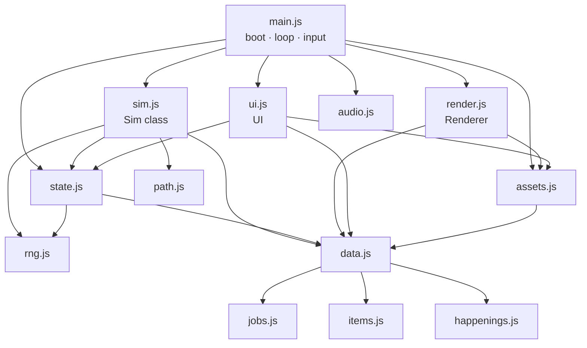

# Architecture

How the game is put together, which function owns what, and the invariants to keep. Pair this with
[RECIPES.md](RECIPES.md) (step-by-step changes) and [../AGENTS.md](../AGENTS.md) (rules).

## 1. Module map

Dependency order (also the bundle order in `tools/bundle.py`):
`rng → path → jobs → items → happenings → data → state → sim → assets → render → audio → ui → main`.

## 2. Boot and loop (`main.js`)

1. `boot()` waits for the pixel font, then `loadAll()` loads every image (atlas first, single files as fallback).
2. `load()` restores a save (or `newGame()`); `new Sim(s, hooks)`; `new Renderer(canvas)`; `new UI(game)`.
   `window.__game` exposes `{ s, sim, rnd, ui, audio }` for debugging and tests.
   URL options: `?new` = wipe the save and start fresh; `?seed=K7F2QX` = fresh village in that world. Both are stripped from
   the address bar right away (`history.replaceState`) so a reload never wipes the save again.
3. The Start button unlocks audio (browsers require a click) and starts the town music. A brand-new village without a charter
   opens the **charter picker** (`ui.charterPick`); `game.modal = true` pauses the sim until one is signed, then the tutorial runs.
4. `frame(now)` every animation frame:
   - fixed-step accumulator: `acc += dt * speed`; run `sim.step()` while `acc >= DT` (0.1 s), **max 40 steps per frame**
     (prevents a spiral after the tab was hidden);
   - camera follow, `rnd.draw(...)`, `ui.tick()` every 0.25 s, autosave when the in-game week changes,
     music choice (boss/cave/battle near the active quest, night, seasonal town theme).
5. Input: pointer drag = pan, wheel/pinch/+/- = zoom (integer 1–6), tap = select or place, WASD/arrows = pan,
   Space = pause, 1/2/3 = speed. Road, Palisade and Remove tools paint while dragging; skipped pointer samples are
   interpolated into contiguous tile lines. Native image dragging and text selection are suppressed on the play surface.

### Palisades and village openings

`DECOR.palisade` is a removable one-tile barrier in Build > Defense. It uses the existing House sheet,
costs 20 G per tile before charter adjustments, and persists as an ordinary building. Leave gaps for passage.
The free home perimeter is derived by `villageBoundary(s)` just outside `s.town`: two three-tile openings
on each side (eight total). Expand moves that perimeter; captured frontier land keeps its existing shape.
Legacy buildings and facility doors take precedence over automatic fence segments. The immediate approaches
to the eight openings are reserved from new construction; roads are allowed, and blocking scenery is cleared.

`Sim.rebuildGrid` caches perimeter cells and a fixed-size barrier mask. Walls block the same path grid used by
adventurers and townsfolk; direct-moving monsters and pets switch to cached paths when obstructed.
Unreachable goals no longer move actors through obstacles. Failed paths retry at most once per simulated
second for an unchanged target, and grid changes/load invalidate cached routes. These caches are rebuilt,
not stored as extra perimeter buildings or timers; no new top-level save fields are required.

## 3. Game state (`s`) — plain JSON, saved as-is

| Field | Meaning |
|---|---|
| `schema, seed, tick, nextId` | save version · RNG running state (mutated by every `R` call — **not** the world code) · step counter · id allocator |
| `world {code, zoneMons, cave, generation, frontierSites, regions}` | founding code and species/cave; generation 1 stores new-world sites and region patterns, while legacy generation 0 retains null layout fields |
| `charter, charterChoices[]` | signed charter id (`null` until chosen; older saves stay `null`) · the 3 ids offered at founding |
| `happen[]`, `happenLog[]` | active happenings `{id, weeks, data}` (`data` is per-happening: merchant `offer[]`, raid `mobs[]`, `breaches`, …) · last 24 `{id, t}` |
| `npcs[]` | happening NPCs `{kind: 'merchant'|'bard', spr, x, y, dir, anim, path?}` — removed by `endHappening` |
| `flags` | one-shot flags and settings (`tutorial`); new settings go here with a default in `newGame` **and** `migrate` |
| `time {week, month, year, t}` | calendar; `t` = seconds into the week |
| `gold, tp, pop, stars` | money · Town Points · popularity (float) · village rank 0–5 |
| `mats {wood, hide, herb, ore, crystal}` | village materials (monster drops) used to develop gear |
| `town {x0,y0,x1,y1}` | buildable rectangle (grows with the Expand event) |
| `mapWidth, mapHeight`, `frontier {completed, relics, petRewards, rolls}` | 152x112 map; completion grants land/bonuses; relic IDs map to one owner or `null`; pet rewards record species/null; rolls hold two saved `{id,value}` affixes per earned relic |
| `banditCamps[]` | 16 world-seeded wilderness sites `{id,name,x,y,tier,clears,readyAt,cooldownWeeks,patrolAt,faction,captainName,modifier}`; persisted 8–20 week recovery and rank-based patrol timing, plus stable faction metadata |
| `ground` (string), `roads` (string of '0'/'1'), `props[]` | terrain detail per cell · road flags · trees/rocks/cave `{k,x,y,w,block,soft?}` |
| `buildings[]` | `{id, type, x, y, lv, sales, visits, occ[], v?, free?}` — `type` is a key of `FAC` or `DECOR`; `free` = charter gift (refunds 0 G) |
| `advs[]` | adventurers (below); a fallen pawn may carry `rescueBy` while another pawn owns its rescue task |
| `mons[]` | wild/quest monsters `{id, type|boss, zone, lv, x, y, hp, mhp, atk, def, target, quest?, ...}`; human raiders can override `job,spr,weapon,className,range`; happenings add `raid: 'stampede'|'bandits'`, `charge {x,y}`, `delay`, `golden`, `flee` |
| `monsters[]` | befriended village monsters `{id, type, name, bond, x, y, riding?}` |
| `folk[]`, `animals[]` | ambient townsfolk (spend small change) and farm animals |
| `unlocked {itemId:true}` | gear the shops can sell |
| `quests[]`, `activeQuests[]` | quest board and active quests without a count/type cap `{kind: outbreak|boss|dungeon|camp, zone, members[], spot, mobs[], floor...}`; old `quest` saves migrate into this array |
| `cleared, bossesBeaten {id:true}` | progression counters |
| `titles {id:true}`, `traits {Name:n}` | earned titles · town trait totals — rebuilt from buildings + village monsters by `recomputeTraits()` on every build/upgrade/tame, so **never write `s.traits` directly** (anything you add there is lost on the next build) |
| `events [{id, weeks}]` | running timed events |
| `log[]` | last 60 ticker messages `{text, kind, t}` |
| `stats` | income this/last month, upkeep, kills, visitors |
| `fx[]` | transient effects — **cleared on save**, never rely on them |

Adventurer (`makeAdventurer` in `state.js`):
`id, name, job, spr (sprite sheet name), lv, xp, jobLv {job: level}, jobXp, base {hp,atk,def,mag}, hp, gold, sat (satisfaction),
work, hunger, energy, fun, persona [PERSONA keys], resident, home (building id), partner (monster id), eq {weapon, armor, offhand, acc, blessing},
perks [PERKS keys], potions, x, y, dir (0 down,1 up,2 left,3 right), path, task, inside, dungeon, ko, stay, days, kills` + animation fields.

**Stat formula** (`stat(a, k, s)` in `state.js`):
`(base + jobBonus + (lv-1)·growth + gear) × (1 + min(0.6, totalJobLevels·0.004) + allPct + <k>Pct perks) × (1 + (work-100)/400) + partner bonus`,
then × title/frontier bonuses and × percentage gear bonuses. Ordinary equipment stays flat; legendary relic HP/ATK/DEF/MAG
bonuses scale the fully developed pawn. `maxHp(a, s) = stat(a, 'hp', s)`.

## 4. The simulation (`sim.js`, class `Sim`)

`step()` order (every 0.1 s of game time):
`calendar` → `spawner` (every 5 steps) → `advStep` for each adventurer → `monStep` → `petStep` → `folkStep` →
`animalStep` → `npcStep` → `folkCensus` (every 50) → `towerStep` → sim timers (delayed hits: burn/combo) → `questCheck` (every 10) → cleanup.

| Area | Functions | Notes |
|---|---|---|
| Grid & building | `rebuildGrid, canPlace, build, demolish, removeRoad, upgrade, door` | walk cost: road 0.55, grass 1, blocked 0. Call `rebuildGrid()` + `invalidatePaths()` after any map change (build/demolish already do). Door = tile below the footprint centre. |
| Traits & titles | `recomputeTraits, bonus(key), eventOn(id)` | traits = sum of `FAC_TRAITS` × (1 + 0.5·(lv-1)); titles fire once; `bonus('visitors')` etc. sums earned title bonuses |
| Calendar | `calendar, monthEnd, taxes, starProgress, checkStars` | every week: `tickHappenings()` then `rollHappening()`. Month end: upkeep 1.5%·cost·lv (× charter), TP = 3 + kills/4 (× charter) + residents, new quest board, star check. April W1 taxes. |
| Spawning | `spawner, edgeSpawn, spawnMonster, spawnBoss, randomCellInZone, zoneMons` | residents and visitors together are limited to `VISITOR_CAP[stars]` (5/5/10/15/20/30). All arrival routes obey this limit; existing over-cap saves retain their pawns and block new arrivals. Regular visitors arrive from the south edge, fewer while popularity and inn beds are low; arrival chance per 0.5 s tick = min(0.1, 0.015 + pop/80000) × bonuses. Wild spawns roll `ELITE_CHANCE` (6%) for an Elite (hp ×1.8, atk ×1.4, def ×1.3; rewards ×2.5, drops ×2, treasure ×3). Zones keep `ZONE_POP` monsters (× charter) picked from `zoneMons(z)` = this world's roster (falls back to `ZONE_MONS` in `data.js`), levels from `ZONE_LV` |
| Adventurer AI | `decide, advStep, insideStep, settleVisit, addSat, tryMoveIn, rescueTarget, rescueStep, releaseRescue` | utility scores (hunger, energy, HP, gear upgrade on sale, potions, training, hunting, fun, leaving) × personality multipliers (`pmul`). Tasks: `visit, hunt, return, stroll, camp, leave, quest, rescue`. Visits hide the adventurer inside for `dur` seconds, then `settleVisit` charges money (village income) and adds satisfaction. Satisfaction ≥ 60 + free home → moves in. |
| Movement | `walkTo, speed, stepToward` | A* path cached per goal + grid version; an optional `PathGrid.find()` predicate constrains defenders to owned land; monsters/pets use straight steps with collision |
| Combat | `huntStep, fight, hitMonster, killMonster, treasure, hurtAdv, koStep` | adventurers hunt in the zone their power allows (`zoneFor`); healers heal first; perks applied here (see §5). Kills: XP shared with adventurers within 5 tiles, gold to the killer, materials to the village, 2.5% treasure chest (unlocks gear), taming chance if a Stable exists. At 0 HP revival resolves first, then an unrevived pawn has one 25% permanent-death roll. The other 75% stay fallen; one free healthy pawn claims it, carries it to a usable bed, or stabilizes it in the field after 60 seconds when no bed is reachable. Rescue claims release safely if the carrier becomes invalid. |
| Monsters | `monStep, petStep, towerStep, fleeStep, chargeStep, raidStrength, spawnRaider` | ordinary outlaws and generated raiders use human sheets and visible weapons and cannot be tamed. Raid strength follows village rank and, at ★5, the leading party's average level; generated classes can use melee, range, magic or healing. Aggro radius 2.2 (boss 4), leash 9 tiles, never enter town — except raiders: stampedes charge the town edge and bandits may chase into town. The Golden Slime flees adventurers. Pets follow their partner and become mounts at bond ≥ 50. Towers credit kills to `s.advs[0]` (known bug, #17). |
| Quests | `refreshQuests, frontierQuest, campQuest, autoQuestParty, questCandidates, questReady, questCost, instantQuest, startQuest, questStep, questCheck, checkQuest, dungeonTick, endDungeon` | any available quests concurrently; each owns its party, targets and completion. Outbreak: kill N mobs; boss: next 2 undefeated and inactive bosses with `star ≤ stars`; dungeon: cave at `cavePos(s)`, floors every 7 s; frontier and camp entries are virtual quests resolved by string ID |
| Happenings & charters | `rollHappening, startHappening, tickHappenings, endHappening, happening(id), merchantOffer, rally, npcStep, charter(key), charterHappen(id), chooseCharter, placeFree, refund` | see §4b |
| Player actions | `build, upgrade, demolish, develop, runEvent, startQuest, changeJob, gift, chooseCharter, buyMerchant` | return `null` on success or an error string (shown as a toast) |
| Jobs | `canChangeJob, jobCost, changeJob, gainXp, master` | change needs current job mastered (or target already learned) + `req` jobs mastered + TP (`TIER_TP`). Reaching job Lv10 calls `master()` → perk added, fanfare. |

Hooks passed to `new Sim(s, hooks)`: `sfx(name)`, `fanfare(title, subtitle)`, `report({income, upkeep, tp, kills})`.

Body armor uses `eq.armor`; one helmet OR shield uses `eq.offhand`. Both contribute stats independently alongside
the weapon and accessory. Migration moves old helmets/shields out of `armor` exactly once. The Armor Shop stocks both
armor slots; the starter Iron Cap gives residents a cheap first helm. There are 86 ordinary items and eight unique relics.

The 37-job roster includes an Archer -> Ranger -> Sharpshooter -> Wildwarden line and dedicated Shogun, Grandmaster,
Empress, Golden Sovereign and Nightblade promotions. Every tier-3 class has at least one tier-4 successor; validation
enforces this. New jobs use existing mastery/perk mechanics, with no additional per-frame scans or save collections.

Residents reserve the total cost of the cheapest usable unlocked weapon, body armor, helm/shield and accessory for each missing
slot, considering only shops that exist. They buy the cheapest missing basic before upgrades. Optional meals,
lessons and potions respect that reserve; urgent hunger, exhaustion and injury can spend it. While saving, urgent
meals favor cost per hunger restored; residents still prefer their free home for rest. `shopPrice()` and
`visitPrice()` include current surcharges so decisions budget the checkout price. Settlement rechecks optional
purchases and weapon compatibility; inn recovery already delivered during a visit is still billed. No new save fields.

Class changes retain every equipment slot. All weapon types are usable with their normal stats; `weaponMatch()` checks
the class's preferred `wt` types for +10% hit damage (after defense, before crit) and +1 combat speed. Attack cooldown is
`1.1 / (job.spd + matchBonus)`; movement and healing speed are unchanged. Abstract cave offense and weapon upgrade scoring
include the corresponding damage-rate bonus. An unequipped default sprite grants no weapon bonus.

An adventurer's `spr` is assigned once by `makeAdventurer()`. Class changes and `teachJob()` preserve this portrait identity.
`pawnSprite()` derives a stable field outfit from the current class and pawn ID, including matching weapon grip and KO art.
Existing saves and roguelite carryover preserve portraits without new saved appearance fields.
Adventurers > Mastered residents lists residents whose current job is mastered. Choose each next job, then apply the batch;
`changeMasteredJobs()` validates all prerequisites, availability and the total TP cost before changing anyone.

`JOBS.attack` identifies bow specialists (`bow`), innate casters (`magic`), and innate throwing classes (`throw`);
omitted means melee. `attackProfile()` derives range, damage type and projectile from current equipment without saved
fields. Any equipped bow fires physical arrows at range 3, or the bow specialist's higher class range. Otherwise innate
attacks retain class range; melee reaches 1 (2 for spears/tridents/whips). Mastery range adds reach without changing effects.
The profile drives field combat, territorial defense and classed raiders (whose explicit weapon sprite resolves to its
catalogue type). Existing damage, affinity, cooldown, healing and cave formulas remain, except equipped bows use physical
damage in the field. Changing class or loading a save immediately derives the correct attack; no gear is removed.

Scout, Archer, Ranger, Sharpshooter and Wildwarden put an available unlocked bow first in `basicGearNeeds()`, even when
already holding stronger melee gear. `bowNeed()` reserves the cheapest available bow's full checkout price; urgent care
keeps the existing exceptions. Once they hold a bow, automatic weapon upgrades remain bows. Without bow stock/shop they
keep normal fallback shopping; a newly stocked bow is considered on the next decision. Settlement rejects stale melee
purchases after a bow becomes available or a class changes into a bow specialist. Innate classes keep their usual preferences.

At dusk (70% through the week), `nightRest()` prioritizes home, affordable inn or outdoor village rest when energy is
below 95. It respects basic-gear savings and urgent hunger, injury, nearby foes, active quests and rescue. Routine
hunts/strolls reconsider bedtime once per second; existing visits finish, including long journeys to captured land.
Camp patrols never trigger village-wide defense or block distant pawns from resting. Outdoors in owned land, pawns
interrupt routine errands or outdoor rest only when a raider targets them within four tiles (or attack range), retaining their task to resume
after danger passes. Local defense routes stay on owned land and do not chase outside it. Indoor pawns, cave parties,
KO pawns and rescuers carrying someone retain their existing behavior. Hunt retreat/potions and quest healing take
priority over retaliation; returning pawns keep retreating. Quest ownership and the interrupted task are preserved.

### Late-game investments

At five stars with a Stable, each pet can become Alpha once through `alphaPet(id)`: 10,000 village gold and
100 each wood, hide, herb, ore and crystal for the first pet, then +100 each per successful upgrade, capped at 500 each.
The persistent `flags.alphaUpgrades` counts purchases; migration counts existing Alpha pets once. Alpha preserves species
and bond, multiplies assist damage and bonded passive stat contributions by 1.5, and uses cached gold sprites with a crown
(including mounts). Alpha sprites are 20px instead of 16px, 25% larger with integer destination dimensions and no smoothing.
The Adventurers panel
shows costs, benefits and blocking reasons before an in-game confirmation. Pet `alpha` defaults to false on creation
and migration; upgrade validation happens before any deduction, so repeat/stale clicks cannot charge twice.

Phoenix Sigils require five stars and a Blacksmith: Develop charges 15,000 village gold, 200 each wood/hide/ore and
500 each herb/crystal once. `researchOnly` excludes the recipe from treasure and merchant licences. Item Shops then
sell a single stored charge for a base 10,000 pawn gold, with existing shop price modifiers. Autonomous purchases
respect basic gear reserves and urgent needs; checkout revalidates unlock, rank, funds and ownership. The boolean
`a.reviveCharge` defaults to false and takes no equipment slot. `tryRevive()` handles field and cave lethal damage:
use an available Undying perk first, otherwise consume the charge and restore half maximum HP. Rest never refills
the paid charge; the pawn may buy a replacement after using it.

Quest selection calls `autoQuestParty()` once from the UI action, never during rendering. It shuffles available pawns
with the seeded RNG, selecting up to four at least half HP, regardless of level. Suggested levels are advisory. The player can adjust the party
to 1-8 available non-KO pawns; slots 5-8 each cost `ceil(entry fee * 0.25)` extra. Depart and the total cost appear before
the pawn grid. `startQuest()` revalidates unique available members and total funds before changing state.
Instant Depart on each card calls `instantQuest()`: validate the entry fee and healthy available pool, then launch with the same
random default party. Clicking the card itself still opens the party picker. No quest count or type cap applies.
Active quest membership reserves a pawn even while recovering in the inn; it cannot join another party or rally.
After recovery it resumes its original quest. Each ending removes only that quest and its own matching pawn tasks.
Every active quest has a separate Watch button and map marker; cave bars and floor labels stack for concurrent parties.
Music follows the nearest active quest.

### Frontier conquests

The world is 152x112 tiles (four times the original area). `expandWorld()` preserves the original 76x56 coordinates,
buildings, actors and roads, padding each terrain/road row rather than reinterpreting its stride. Added terrain uses a
separate deterministic RNG; migration leaves the running simulation seed untouched and is idempotent. The frontier
extends east and south, with sparse scenery and cleared den approaches. Ordinary spawns, visitor arrival/departure
retain the original home-region bounds and population caps. Bandit companies march from their camp sites.

`FRONTIERS` defines eight connected one-time challenges, prerequisites, rank/level guidance, land, bonuses and relics.
New villages use `world.js`: `world.frontierSites` stores same-star slot shuffles, jittered territory boundaries and den
locations; `getFrontiers(s)` is the positional source everywhere. Established home hunting terrain outside frontier
territories remains intact for early pacing. `world.regions` stores bounded forest, clearing, pass
and ruin patterns with biome tints. Generation uses its own world-code RNG and carves routes to every den/camp/cave.
Older villages default to the static sites and retain their terrain; loading never regenerates geography. Region tints
are baked into the existing cached ground layer, and dormant sites still create no actors.
Sites are data and map markers only; opening a site never spawns a monster. `frontierQuest()` returns a virtual quest
with ID `frontier:<site>`. `startQuest()` validates rank, prerequisites, membership and cost before spawning its single
guardian. It shares normal party selection and extra fees, but allows 600 seconds for the longer journey and fight.
Failure cleans up the guardian and permits retry. Victory records completion once and grants land, a small permanent
bonus and one relic. It does not mark the reused boss artwork's regular quest complete. Completed sites cannot repeat.

Each captured site also has a one-time 30% chance to grant a rare companion from `FRONTIER_PETS`. A fixed world/site
seed prevents reload rerolls and leaves the main RNG untouched. `frontier.petRewards` records species or null for misses.
Sim initialization awards missing rolls for already completed sites once. These companions have their originating
`frontier` ID, arrive even without a Stable or when full, and do not consume ordinary taming capacity (at most eight
bonus pets). The original guaranteed relic reward remains independent.

The regular boss board refills on load, rank-up and completion, keeping the next two undefeated eligible bosses.
After all 15 first clears, four legendary bosses rotate through repeatable rematches. `flags.bossRematches` persists
victories; each round adds 20% stats/rewards and five recommended levels, capped at level 99. Failed attempts retry
the same stage. Rematches cannot duplicate frontier land or relic rewards.

`buildAreas()` combines the original town with captured rectangles; `townDist()` and footprint validation use that union.
Capture clears blocking scenery and rebuilds paths. Normal paid expansion still expands only the original town.
Distant facility visits receive travel time proportional to distance, initialized on the visit task when first needed.
Bonuses derive from the completion ledger via `frontierBonus()`, never from repeatedly incremented counters.

Legendary relics have `legendary: true`, `slot: 'blessing'` and cannot be developed, stocked, purchased or duplicated.
`equipRelic()` assigns one permanent blessing per resident in `eq.blessing`, returning a replaced blessing to the vault.
Each relic has one owner; owners away on quests or KO must return first. Their percentage bonuses multiply the final
developed stats on top of all four ordinary equipment slots and have no timer. Migration moves ledger-owned legendary accessories into the blessing slot once, frees the
accessory slot, preserves ordinary accessories and removes unowned duplicates against the eight-entry ledger.

`relics.js` adds two distinct percentage bonus traits to each of the eight unique rewards: HP, attack, defense, magic,
movement speed or critical chance, with bounded rolled quality values. `frontier.rolls[relicId]` stores them once; world code plus item ID
makes capture order, retries and reloads unable to reroll. Existing earned relics gain rolls on migration without losing
base quality or ownership. `relicItem(s,id)` maps saved quality to the current percentage range for stat calculations and
UI; the roll shape stays unchanged. Base core bonuses are 8–20%; rolled HP adds 8–12%, attack/defense/magic 5–8%,
movement speed 4–7%, and critical chance 2–4 percentage points. `gearSum(a,key,s)` requires state to include the rolled bonuses. There are no additional relic copies/drops.

Victory stores the relic in the guild vault, not a pawn inventory. The vault appears before the territory list in
Frontiers, with unassigned rewards and their current owners shown explicitly. Armor and Item Shops both sell ordinary
accessories through `SHOP_SLOTS`; their stock displays use the same mapping as autonomous shopping.

The Frontiers panel is reached from the Quest Board or by tapping a den. It shows locks, rewards, party controls,
capture status and the relic vault. Show on map centers and outlines the territory. The renderer reuses one fixed
native-resolution ground canvas (about 16.6 MiB), rebuilding only when roads or claimed land change; it does not allocate
a new full-map surface every frame. A* has a map-sized search budget. Neither the world size nor inactive sites
increase monster population or create recurring boss timers.

Each frontier uses a distinct 2x landmark assembled from the existing licensed atlas: forest den, grotto, ruined fort,
torii hollow, caldera, storm shrine, frozen cavern or crown vault. Decorative side pieces disappear and the anchor returns
to 1x after capture so the landmark does not imply a larger blocked footprint on newly buildable land. The visible composition, not only its ground
tile, is clickable.

### Bandit camps

`seedBanditCamps()` deterministically places 16 camps from the world code with an isolated RNG, so migration does
not advance the running simulation seed. Each site reserves a 3x3 core and stores its tier, clear count and cooldown tick.
`campQuest()` exposes a virtual `camp:<site>` quest with a rank-scaled recommended level, 5/7/9/11 generated human raiders,
entry fee and gold/TP/popularity/material rewards. Camp defenders spawn only on challenge; departure uses the
normal 1-8 pawn party rules and creates the raiders. Victory increments `clears`, awards the stores and rolls a persisted
8–20 week cooldown. Migration extends a pending legacy four-week cooldown once while retaining its elapsed time; its
isolated RNG does not advance the running simulation seed. Failure removes that attempt's raiders and permits another
attempt without changing the ledger.

`camps.js` seeds faction, captain name and at most one modifier per camp without moving old camps, resetting their
timers or advancing simulation RNG. Iron Company favors melee/archers and ore; Moonfang Hunters favor ranged classes
and hide/wood; Ash Covenant favors casters with at most one healer and herb/crystal. Class tiers stay level-gated.
Challenge modifiers trade 4% attack for 4% HP, redistribute strength to a veteran captain, or add one store material.
Patrols and raids use faction composition with no captain/modifier stat boost. Counts, levels, schedules and territorial
defense are unchanged. The camp panel previews composition, modifier and actual material payout before departure.

Live camps at or below village rank send seeded guard patrols using `CAMP_PATROLS`: stars 1/2/3/4/5 send 1/1/1/2/2–3
guards at levels 1–3/3–5/5–8/8–12/12–20. Intervals are `(7 - stars)` to `(9 - stars)` weeks, globally across all camps.
There is one group per camp and at most 12 patrol guards globally. Patrols
use generated human classes without rallying pawns, follow a path from the real camp, and expire after their
travel allowance plus two weeks. Pawns encounter them through normal nearby combat; only large raid happenings trigger
territorial defense, and existing defense orders end when only patrols remain. They are separate from camp quest defenders. Clearing a
camp recalls its patrols and postpones its next departure by the rank-based interval after its 8–20 week recovery.
Initial timers use isolated RNG. The one-time `flags.patrolScaling` migration resets old rapid schedules and reduces
existing over-level patrols to the rank cap, preserving their remaining health fraction and leaving other enemies alone.
Schedules persist through loads. Scheduling runs once per second; no callback timer is retained.

The Bandit Camps panel is reached from the Quest Board or by tapping the camp's visible ±3-tile landmark. It shows all 16
sites, rank locks, cooldown, reward, clear count, party controls and Watch/Show on map. The renderer draws dormant camps
without standing garrisons; tier changes the existing hut, fence, cart and supply composition.

## 4b. Replayability layer — happenings, charters, seeded world (`happenings.js` + `sim.js`)

Not in DV2; our own. Everything is driven by the seeded RNG, so **the same world code + the same player choices replay identically**
(`tests/happenings.mjs` checks this).

- **World** (`newGame(seed)`): shuffles each zone's `ZONE_MONS` and keeps `ROSTER_SIZE[z]` species, picks the Old Cave tile,
  and offers 3 of the `CHARTERS`. `s.world.code` keeps the seed; `seedCode()`/`parseSeed()` convert it to/from base 36.
- **Happenings** (`HAPPENINGS` table): each week `rollHappening()` fires with `HAPPEN_CHANCE` (+ charter `happenChance`, max 95%),
  picks by `weight` (× charter `happen` multiplier) among those with `minStars ≤ stars`, not active and not among the last 3.
  `startHappening(id)` sets it up (a `case` per id), `tickHappenings()` counts `weeks` down and calls `endHappening(h)` for
  rewards/penalties and clean-up (NPCs removed, leftover raiders despawned). Passive ones (`rain sunny harvest fog`) are just
  read where they apply with `this.happening('rain')`.
- **Raids**: `raidStrength()` derives count and level from village rank, then also considers the top four adventurers at ★5.
  `stampede` monsters charge the edge (breach = −3 popularity and gold, max 5 penalties). A bandit raid selects one ready,
  unchallenged camp, records it as `h.data.camp` and on each raider as `sourceCamp`, and gives the company enough time to
  march from that site to the village. With no eligible camp the happening cannot start. Bandits that are still outside
  owned land when time expires turn back without theft. `rally()` sends free, healthy, non-rescuing adventurers to defend;
  defenders inside owned land hold there using constrained A*, while defenders already outside return to the nearest owned
  defense point. Rewards and arrival-gated theft scale with strength, then charter `raidReward` applies.
- **Charters** (`CHARTERS` table): `chooseCharter(id)` applies `start` once (gold, free buildings/decor via `placeFree` — marked
  `free`, refund 0 — and an optional starting adventurer) and stores the id. `charter(key)` returns the numeric mod (0 if none);
  every key is read exactly where it applies:

| mods key | read in | effect |
|---|---|---|
| `shopSales` | `settleVisit` (gear + potions) | shop sales × (1 + v) |
| `visitors` | `spawner` | visitor rate × (1 + v) |
| `killGold` | `killMonster` | kill gold × max(0.1, 1 + v) |
| `monsterPop` | `spawner` | zone population × (1 + v) |
| `decorAppeal` | `appeal` | decor appeal × (1 + v) |
| `joy` | `addSat` | satisfaction gains × (1 + v) |
| `buildCost` | `cost` (build, canPlace, UI) | building prices × (1 + v) |
| `matDrops` | `killMonster`, meteor | material drop chance / crystals × (1 + v) |
| `jobXp` | `gainXp` | job EXP × (1 + v) |
| `tamePct` | `killMonster` | befriend chance × (1 + v) |
| `treasure` | `killMonster` | treasure chest chance × (1 + v) |
| `upkeep` | `monthEnd` | upkeep × (1 + v) |
| `tpKills` | `monthEnd` | the kill part of monthly TP × (1 + v) |
| `happenChance` | `rollHappening` | + v to the weekly chance |
| `raidReward` | `endHappening` | raid rewards × (1 + v) |
| `happen: {id: m}` | `rollHappening` via `charterHappen(id)` | that happening's weight × m |

`tests/validate.mjs` fails on an unknown mods key, a known key that `sim.js` never reads, a happening without a `case` in
`startHappening`, a bad `start` entry, a missing icon, or a `ROSTER_SIZE` larger than its zone list.

## 5. Perks (mastery) — how effects are wired

`perkSum(a, key)` (state.js) adds that key across all perks the adventurer has mastered. Where each key is read:

| Key | Read in | Effect |
|---|---|---|
| `allPct, hpPct, atkPct, defPct, magPct` | `stat()` | % stat bonus |
| `spdPct` | `speed()` | move speed |
| `range` | `fight()` | + attack range (tiles) |
| `crit, critMul` | `fight()` | crit chance / crit multiplier bonus (base 8% · ×1.8) |
| `splash, splashAll` | `fight()` | magic splash bonus / every attack splashes |
| `doubleHit, burn` | `fight()` via sim timers | second hit / damage-over-time |
| `execute` | `fight()` | finish non-boss below 30% HP |
| `lifesteal` | `fight()` | heal % of damage |
| `auraAtk` | `fight()` (from nearby allies with `roar`) | +% damage |
| `healPct` | `fight()` heals, potions | +% healing |
| `dodge` | `hurtAdv()` | miss chance, capped at 35% total |
| `revive` | `hurtAdv()` | survive one lethal hit per outing (reset when sleeping) |
| `goldPct, popKill, treasurePct, tamePct` | `killMonster()` | kill rewards |
| `xpPct` | `gainXp()` | EXP |
| `bondPct` | `petStep()`, `stat()`, `fight()` | partner bond speed and power |
| `incomePct` | `royalAura()` → `settleVisit()` | village sales (+8% per resident, max +25%) |

`tests/validate.mjs` fails if a perk uses a key that is not in its `KNOWN_PERK_KEYS` list or that `sim.js`/`state.js` never read.

## 6. Rendering (`render.js`, class `Renderer`)

- Device pixel ratio capped at 2; `scale = round(zoom × dpr)` device pixels per source pixel (always an integer).
- Static layer (`buildStatic`): ground tiles + road autotiles (47-tile blob set in `ROAD_TILES`, signature N,E,S,W,NE,SE,SW,NW),
  cached until `s.roads`, `s.town` or captured territories change.
- Each frame: draw frontier/camp landmarks, then collect visible props, buildings, palisades, adventurers, folk, animals,
  village monsters, wild monsters and happening NPCs → sort by foot y → draw. Then build ghost, FX, quest marker,
  seasonal particles (rain during a Rainy Week), night tint (multiply),
  `drawSky` (rain gloom, pixel fog from `fog.png`, warm sun, meteor streaks at night), then screen-space overlays (damage
  numbers, coins, emotes, barks, names, HP bars, building level stars, `drawEdgeArrows`: red = off-screen raider, gold = Golden Slime).
- Outlaws (`drawHuman`): character sheet + in-hand weapon through the same `drawWeapon` as adventurers (a stand-in object
  carries `x, y, dir, atkT, spr, job`). Generated raiders override their sheet, weapon and class label. Fallen adventurers
  are drawn opaque and horizontal; carried bodies remain visible beside the rescuer. Elites use `tinted(sheet, 150)` +
  `crown()` + a purple HP bar.
- Happenings: raiders get a red marker; the Golden Slime is drawn with `goldified()` (luminance → gold ramp) plus `sparkle()`;
  the merchant sits by a rug showing his three licences (`drawNpc`), the bard strolls with a music note.
- Sheets: characters 64×112 = 4 columns (down, up, left, right) × 7 rows (0–3 walk, 4 attack, 5 jump, 6 misc);
  monsters 64×64 = 4 dirs × 4 frames. Most use direction columns; `MONSTERS[].sheetRows` identifies sheets with
  direction rows (down, left, up, right). Wild, companion and mounted rendering all honor this layout. Bosses = one
  row of `frames` frames of `fw×fh`.
- Palisades choose horizontal halves and vertical pieces from their north/east/south/west neighbors in the combined
  player-wall and village-boundary barrier mask. Corners, T junctions and crosses share this rule with build previews.
- Pawn held weapons come only from `eq.weapon`; empty slots never fall back to the class's weapon sprite. Outlaws use
  their explicit enemy weapon. Held weapons (`drawWeapon`): the grip pixel for every (sheet, dir, row) is detected at load by `computeHands` in
  `assets.js` (outermost opaque pixel on the facing side below the head, 1 px inside the outline). The in-hand sprite is
  rotated around that pixel: carry = blade up leaning forward; attack = swing arc / thrust / raised tome / drawn bow.
  Hidden behind the body when facing up; bows are slung on the back when idle. Tiers are recoloured with `tinted()`.

## 7. UI (`ui.js`, class `UI`)

- Panels: `open(name)` renders `panel_<name>()` (build, people, quests, frontiers, camps, develop, village, system, jobs) into `#panel-body`.
  Live panels re-render every 0.25 s but only when the HTML string changed (`setBody` diff) and **never while the
  pointer is down** on a panel (prevents lost clicks).
- Quest, frontier and camp party choices are semantic buttons with keyboard focus, `aria-pressed`, explicit Select/Selected
  text and a high-contrast selected style. The People and Jobs panels give a mastered current job a prominent checked badge.
- All clicks go through one delegated handler: elements with `data-act="<name>"` call `act(name, dataset)`.
  Existing actions: `buyMerchant cat charter classes demolish deselect devTab develop event exitBuild export follow gift import jobs
  newgame open partners pick pickQuest reroll save seedGame selAdv setJob setPartner startQuest togParty tool upgrade watchQuest`.
- Sprites inside HTML are placeholders replaced by `hydrate()`: `<i data-spr="SPRKEY">`, `<i data-face="IMGKEY">`,
  `<i data-item="ITEMID">` (tinted item icon), `<i data-char="SheetName">`, `<i data-mon="MonsterSpr">`, `<i data-icon="IMGKEY">`,
  `<i data-key="IMGKEY" data-px="32">` (square crop of any image, first frame of a strip — used by chips and charter cards);
  add `data-gold="1"` to a `data-face` for the gold recolour.
- Inspector (`renderInspector`) for the selected adventurer / building / monster; build mode (`enterBuild/exitBuild`)
  with a ghost preview; fanfare queue (`fanfare()`), toasts (`toast()`), in-game confirm (`ask()`), goals HUD (`goals()`).
- Happenings UI: `happenChips()` (top bar; icons only on phones), `thisWeek()` (Village panel: charter, active happenings,
  merchant licences via `merchantCards()`, history), `inspNpc()` (tap the merchant or his rug), `charterPick()` (modal).
  The System panel shows the world code and can found a village from a typed code (`?seed=`).
- The top bar wraps on phones; `tick()` moves `#ticker`, `#toast`, `#goals` below its measured height.

## 8. Assets (`assets.js`)

`assetList()` returns every `[key, path]` the game loads. Key prefixes:

| Prefix | Example | Source |
|---|---|---|
| (none) | `floor, nature, house, element, towers, field, shadow, chest, coin` | tilesets / misc |
| `c_` / `f_` | `c_Knight`, `f_Knight` | character sheet / portrait (`assets/chars/<Name>.png`, `.face.png`) |
| `m_` / `mf_` | `m_Slime`, `mf_Slime` | monster sheet / portrait |
| `b_` / `bf_` | `b_cyclop`, `bf_cyclop` | boss idle sheet / portrait (keyed by BOSSES id) |
| `an_` | `an_Chicken` | farm animal |
| `e<N>` | `e27` | emote bubble N |
| `i_` | `i_w_Katana`, `i_a_plate`, `i_c_ring` | item icons (`assets/items/<icon>.png`) |
| `h_` | `h_Katana`, `h_Bow2` | in-hand weapon sprites (`h_<X>.png`; bows use `w_<Bow>.png`) |
| `fx_`, `p_`, `pt_` | `fx_slash`, `p_arrow`, `pt_Leaf`, `pt_Rain` | effects, projectiles, particles |
| (none) | `fog` | 320×180 fog texture for the Mysterious Fog happening |
| `deco_` | `deco_castle` | Medieval Fantasy decor images |

`loadAll()` tries `assets/atlas/atlas.json` first and slices each sprite onto its own canvas (so the rest of the code
never knows about the atlas); anything missing from the atlas is loaded as a single file.

## 9. Saving (`state.js`)

`save(s)` writes JSON to one of two rotating localStorage slots (`wayfarerV2_a`/`_b`, pointer `wayfarerV2_last`), so a
torn write never loses everything. `load()` tries the newest slot, then the other; `valid()` checks the basic shape;
`migrate()` upgrades old saves (renamed items/jobs, new fields, cave prop, malformed `world` data). It runs on **every** load —
including brand-new saves in `check.mjs` — so every transform must be a no-op on a current save: guard on the OLD field's
presence (`if (a.base.hp !== undefined) {…}`), never on `s.schema`. Autosave every in-game week and when the tab is hidden.
System panel: Save now, Export (download + clipboard), Import (file), New game (in-game confirm).

New Game and the world-code start open a choice between a fresh village and a roguelite pioneer. `legacyGame()` builds
a separate fresh state without changing the source village. One selected pawn returns as a level-1 Villager, keeping
identity and up to five seeded-random mastered jobs (at mastery level 10, with exactly those perks); equipment, money,
work, experience and activity state reset. The pawn starts as a resident in the initial house. Their bonded pet plus
one distinct selected frontier-reward pet keep species, name, bond and Alpha status; IDs and positions are rebuilt.
Old pet frontier origins identify legendary companions but never populate the new conquest/reward ledger.
`flags.pioneer` and `flags.pioneerPet` default to null and preserve these selections through charter world rerolls.
The new state is saved before navigation and old-state autosaving is disabled only after success. Cancelling or a
failed save keeps the current village open. Masteries are rolled after confirmation, never during panel rendering.

## 10. Performance budget

Measured with `node v2/tests/bot.mjs 30 1`: ≈100–130 µs per sim step with ~65 adventurers (budget: < 400 µs).
Rules: no allocation-heavy work per step (cache grids/paths), no per-frame DOM rebuilds, cull off-screen drawing,
keep visitors capped, keep `s.log` bounded (60).

### Destructible watchtowers

Watchtowers have 120 HP at level 1 and gain 60 maximum/current HP per upgrade (existing damage remains).
Old saves initialize missing tower health at their current level; damaged health persists across loads.
Enemies without a pawn target acquire towers within four tiles. Tower shots explicitly draw retaliation,
instead of assigning aggro to the pawn credited with the kill. A pawn hitting the enemy can draw it back.
Melee enemies path to reachable attack cells outside the blocked tower footprint; ranged and magic enemies
use their existing weapon profiles. Camp sentries retain their five-tile leash. At zero HP the tower is removed
without refund, stops firing, clears enemy references, and updates paths and village traits. Other buildings
and palisades remain unchanged. Damaged towers show a map health bar; the inspector always lists tower HP.

### Bounty flags and camp sentries

Double-click/tap the map outside build mode to call `placeBounty(x,y)`: 500 town gold, one active flag,
five-tile radius, two weeks from placement (60 simulation seconds; pause freezes it and speed advances it).
Seeded selection takes 2-4 reachable pawns at >=75% HP, >=30 energy and <80 hunger; quests, rescues,
retreats, sleep, indoor visits and departures are unavailable. Failed placement spends nothing.
Saved `bounty` defaults to null and stores the circle, reachable arrival tile, member IDs and expiry tick.
Travel is included in the duration. After arrival paths stay inside the circle and target only non-quest enemies.
Low HP, exhaustion or starvation releases the pawn to return home; KO/death removes its reservation.
Quests lists the patrol, remaining time, Watch and Recall (no refund). No boss challenge starts automatically.

Each live bandit camp maintains two town-level-scaled human `campGuard` sentries, separate from attack waves.
They wander and fight within five tiles and never rally the whole village. Clearing or challenging the camp
removes them; a fallen sentry is replaced after one week (`guardAt`, migration default 0). The camp's existing
8-20 week clear cooldown and outgoing attack schedules are unchanged. At most 32 living sentries exist.

### Mortality and weapon recovery

`fall()` handles field and cave defeats: innate revival, then Phoenix Sigil, then one seeded 25% death roll.
A surviving KO cannot roll again until recovered. Death removes the pawn, frees home/occupancy and quest membership,
releases rescue claims and pet riding, and returns owned legendary blessings to the frontier vault. Delayed attacks from
removed pawns cannot award XP or loot. Empty parties fail their quests without victory rewards.
`weaponDrops[]` stores `{id,item,x,y,name}` for the equipped weapon, with no expiry; cave drops appear at the entrance.
Click a map crate or use Adventurers > Guild Stash to recover it. `weaponStash` counts original weapon IDs.
Assignment to an available resident exchanges the previous weapon back into the stash. Recovery is idempotent;
new games and migrations default both collections empty. Old KOs remain KOs and are not retrospectively rolled for death.
