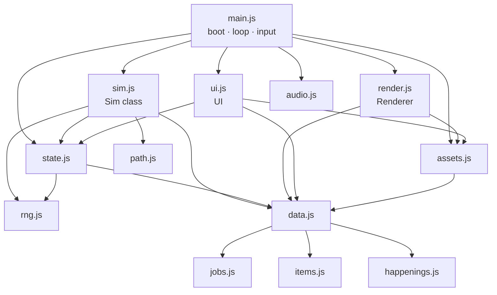

# Architecture

How the game is put together, which function owns what, and the invariants to keep. Pair this with
[RECIPES.md](RECIPES.md) (step-by-step changes) and [../AGENTS.md](../AGENTS.md) (rules).

## 1. Module map

Dependency order (also the bundle order in `tools/bundle.py`):
`rng → path → jobs → items → happenings → data → state → sim → assets → render → audio → ui → main`.

## 2. Boot and loop (`main.js`)

1. `boot()` waits for the pixel font, then `loadAll()` loads every image (atlas first, single files as fallback).
2. `load()` restores a save (or `newGame()`); `new Sim(s, hooks)`; `new Renderer(canvas)`; `new UI(game)`.
   `window.__game` exposes `{ s, sim, rnd, ui, audio }` for debugging and tests.
   URL options: `?new` = wipe the save and start fresh; `?seed=K7F2QX` = fresh village in that world. Both are stripped from
   the address bar right away (`history.replaceState`) so a reload never wipes the save again.
3. The Start button unlocks audio (browsers require a click) and starts the town music. A brand-new village without a charter
   opens the **charter picker** (`ui.charterPick`); `game.modal = true` pauses the sim until one is signed, then the tutorial runs.
4. `frame(now)` every animation frame:
   - fixed-step accumulator: `acc += dt * speed`; run `sim.step()` while `acc >= DT` (0.1 s), **max 40 steps per frame**
     (prevents a spiral after the tab was hidden);
   - camera follow, `rnd.draw(...)`, `ui.tick()` every 0.25 s, autosave when the in-game week changes,
     music choice (boss/cave/battle near the active quest, night, seasonal town theme).
5. Input: pointer drag = pan, wheel/pinch/+/- = zoom (integer 1–6), tap = select or place, WASD/arrows = pan,
   Space = pause, 1/2/3 = speed. Road and Remove tools paint while dragging.

## 3. Game state (`s`) — plain JSON, saved as-is

| Field | Meaning |
|---|---|
| `schema, seed, tick, nextId` | save version · RNG running state (mutated by every `R` call — **not** the world code) · step counter · id allocator |
| `world {code, zoneMons, cave}` | the seed the village was founded with (`seedCode()` shows it as base 36; `null` for older saves) · species per zone for this world (`{zone: [MONSTERS ids]}`, `ROSTER_SIZE` long) · Old Cave tile `{x, y}` (read it with `cavePos(s)`) |
| `charter, charterChoices[]` | signed charter id (`null` until chosen; older saves stay `null`) · the 3 ids offered at founding |
| `happen[]`, `happenLog[]` | active happenings `{id, weeks, data}` (`data` is per-happening: merchant `offer[]`, raid `mobs[]`, `breaches`, …) · last 24 `{id, t}` |
| `npcs[]` | happening NPCs `{kind: 'merchant'|'bard', spr, x, y, dir, anim, path?}` — removed by `endHappening` |
| `flags` | one-shot flags and settings (`tutorial`); new settings go here with a default in `newGame` **and** `migrate` |
| `time {week, month, year, t}` | calendar; `t` = seconds into the week |
| `gold, tp, pop, stars` | money · Town Points · popularity (float) · village rank 0–5 |
| `mats {wood, hide, herb, ore, crystal}` | village materials (monster drops) used to develop gear |
| `town {x0,y0,x1,y1}` | buildable rectangle (grows with the Expand event) |
| `ground` (string), `roads` (string of '0'/'1'), `props[]` | terrain detail per cell · road flags · trees/rocks/cave `{k,x,y,w,block,soft?}` |
| `buildings[]` | `{id, type, x, y, lv, sales, visits, occ[], v?, free?}` — `type` is a key of `FAC` or `DECOR`; `free` = charter gift (refunds 0 G) |
| `advs[]` | adventurers (below) |
| `mons[]` | wild/quest monsters `{id, type|boss, zone, lv, x, y, hp, mhp, atk, def, target, quest?, ...}`; happenings add `raid: 'stampede'|'bandits'`, `charge {x,y}`, `delay`, `golden`, `flee` |
| `monsters[]` | befriended village monsters `{id, type, name, bond, x, y, riding?}` |
| `folk[]`, `animals[]` | ambient townsfolk (spend small change) and farm animals |
| `unlocked {itemId:true}` | gear the shops can sell |
| `quests[]`, `activeQuests[]` | quest board and up to three active quests (one per kind) `{kind: outbreak|boss|dungeon, zone, members[], spot, mobs[], floor...}`; old `quest` saves migrate into this array |
| `cleared, bossesBeaten {id:true}` | progression counters |
| `titles {id:true}`, `traits {Name:n}` | earned titles · town trait totals — rebuilt from buildings + village monsters by `recomputeTraits()` on every build/upgrade/tame, so **never write `s.traits` directly** (anything you add there is lost on the next build) |
| `events [{id, weeks}]` | running timed events |
| `log[]` | last 60 ticker messages `{text, kind, t}` |
| `stats` | income this/last month, upkeep, kills, visitors |
| `fx[]` | transient effects — **cleared on save**, never rely on them |

Adventurer (`makeAdventurer` in `state.js`):
`id, name, job, spr (sprite sheet name), lv, xp, jobLv {job: level}, jobXp, base {hp,atk,def,mag}, hp, gold, sat (satisfaction),
work, hunger, energy, fun, persona [PERSONA keys], resident, home (building id), partner (monster id), eq {weapon, armor, acc},
perks [PERKS keys], potions, x, y, dir (0 down,1 up,2 left,3 right), path, task, inside, dungeon, ko, stay, days, kills` + animation fields.

**Stat formula** (`stat(a, k, s)` in `state.js`):
`(base + jobBonus + (lv-1)·growth + gear) × (1 + min(0.6, totalJobLevels·0.004) + allPct + <k>Pct perks) × (1 + (work-100)/400) + partner bonus`,
then × (1 + `titleBonus(s, k)`) — e.g. the Iron Fortress title gives `def: 0.15`. `maxHp(a, s) = stat(a, 'hp', s)`.

## 4. The simulation (`sim.js`, class `Sim`)

`step()` order (every 0.1 s of game time):
`calendar` → `spawner` (every 5 steps) → `advStep` for each adventurer → `monStep` → `petStep` → `folkStep` →
`animalStep` → `npcStep` → `folkCensus` (every 50) → `towerStep` → sim timers (delayed hits: burn/combo) → `questCheck` (every 10) → cleanup.

| Area | Functions | Notes |
|---|---|---|
| Grid & building | `rebuildGrid, canPlace, build, demolish, removeRoad, upgrade, door` | walk cost: road 0.55, grass 1, blocked 0. Call `rebuildGrid()` + `invalidatePaths()` after any map change (build/demolish already do). Door = tile below the footprint centre. |
| Traits & titles | `recomputeTraits, bonus(key), eventOn(id)` | traits = sum of `FAC_TRAITS` × (1 + 0.5·(lv-1)); titles fire once; `bonus('visitors')` etc. sums earned title bonuses |
| Calendar | `calendar, monthEnd, taxes, starProgress, checkStars` | every week: `tickHappenings()` then `rollHappening()`. Month end: upkeep 1.5%·cost·lv (× charter), TP = 3 + kills/4 (× charter) + residents, new quest board, star check. April W1 taxes. |
| Spawning | `spawner, edgeSpawn, spawnMonster, spawnBoss, randomCellInZone, zoneMons` | visitors arrive from the south edge: at most `VISITOR_CAP[stars]` (5/5/10/15/20/30) at once, fewer while popularity and inn beds are low; arrival chance per 0.5 s tick = min(0.1, 0.015 + pop/80000) × bonuses. Wild spawns roll `ELITE_CHANCE` (6%) for an Elite (hp ×1.8, atk ×1.4, def ×1.3; rewards ×2.5, drops ×2, treasure ×3). Zones keep `ZONE_POP` monsters (× charter) picked from `zoneMons(z)` = this world's roster (falls back to `ZONE_MONS` in `data.js`), levels from `ZONE_LV` |
| Adventurer AI | `decide, advStep, insideStep, settleVisit, addSat, tryMoveIn` | utility scores (hunger, energy, HP, gear upgrade on sale, potions, training, hunting, fun, leaving) × personality multipliers (`pmul`). Tasks: `visit, hunt, return, stroll, camp, leave, quest`. Visits hide the adventurer inside for `dur` seconds, then `settleVisit` charges money (village income) and adds satisfaction. Satisfaction ≥ 60 + free home → moves in. |
| Movement | `walkTo, speed, stepToward` | A* path cached per goal + grid version; monsters/pets use straight steps with collision |
| Combat | `huntStep, fight, hitMonster, killMonster, treasure, hurtAdv, koStep` | adventurers hunt in the zone their power allows (`zoneFor`); healers heal first; perks applied here (see §5). Kills: XP shared with adventurers within 5 tiles, gold to the killer, materials to the village, 2.5% treasure chest (unlocks gear), taming chance if a Stable exists. HP 0 → KO → walks home at half speed. |
| Monsters | `monStep, petStep, towerStep, fleeStep, chargeStep` | outlaws (`MONSTERS[x].human`) use the same AI but slash with their weapon (`atkT` drives the attack pose) and can't be tamed; the Bandit Raid gang is picked by rank and scaled by `f` (0.55–1.0) in `startHappening('bandits')`. Aggro radius 2.2 (boss 4), leash 9 tiles, never enter town — except raiders: stampede monsters `chargeStep` straight at the town edge (a breach costs popularity/gold), bandits may chase into town; the Golden Slime `fleeStep`s away from adventurers. Pets follow their partner, become mounts at bond ≥ 50. Towers credit kills to `s.advs[0]` (known bug, #17). |
| Quests | `refreshQuests, autoQuestParty, questCandidates, questCost, startQuest, questStep, questCheck, checkQuest, dungeonTick, endDungeon` | one outbreak, boss and dungeon concurrently; each owns its party, targets and completion. Outbreak: kill N mobs; boss: next 2 undefeated and inactive bosses with `star ≤ stars`; dungeon: cave at `cavePos(s)`, floors every 7 s |
| Happenings & charters | `rollHappening, startHappening, tickHappenings, endHappening, happening(id), merchantOffer, rally, npcStep, charter(key), charterHappen(id), chooseCharter, placeFree, refund` | see §4b |
| Player actions | `build, upgrade, demolish, develop, runEvent, startQuest, changeJob, gift, chooseCharter, buyMerchant` | return `null` on success or an error string (shown as a toast) |
| Jobs | `canChangeJob, jobCost, changeJob, gainXp, master` | change needs current job mastered (or target already learned) + `req` jobs mastered + TP (`TIER_TP`). Reaching job Lv10 calls `master()` → perk added, fanfare. |

Hooks passed to `new Sim(s, hooks)`: `sfx(name)`, `fanfare(title, subtitle)`, `report({income, upkeep, tp, kills})`.

Quest selection calls `autoQuestParty()` once from the UI action, never during rendering. It shuffles available pawns
with the seeded RNG, selecting up to four at the suggested level and at least half HP. The player can adjust the party
to 1-8 available non-KO pawns; slots 5-8 each cost `ceil(entry fee * 0.25)` extra. Depart and the total cost appear before
the pawn grid. `startQuest()` revalidates unique members, the type slot and total funds before changing state.
Active quest membership reserves a pawn even while recovering in the inn; it cannot join another party or rally.
After recovery it resumes its original quest. Each ending removes only that quest and its own matching pawn tasks.
Every active quest has a separate Watch button and map marker; music follows the nearest active quest.

## 4b. Replayability layer — happenings, charters, seeded world (`happenings.js` + `sim.js`)

Not in DV2; our own. Everything is driven by the seeded RNG, so **the same world code + the same player choices replay identically**
(`tests/happenings.mjs` checks this).

- **World** (`newGame(seed)`): shuffles each zone's `ZONE_MONS` and keeps `ROSTER_SIZE[z]` species, picks the Old Cave tile,
  and offers 3 of the `CHARTERS`. `s.world.code` keeps the seed; `seedCode()`/`parseSeed()` convert it to/from base 36.
- **Happenings** (`HAPPENINGS` table): each week `rollHappening()` fires with `HAPPEN_CHANCE` (+ charter `happenChance`, max 95%),
  picks by `weight` (× charter `happen` multiplier) among those with `minStars ≤ stars`, not active and not among the last 3.
  `startHappening(id)` sets it up (a `case` per id), `tickHappenings()` counts `weeks` down and calls `endHappening(h)` for
  rewards/penalties and clean-up (NPCs removed, leftover raiders despawned). Passive ones (`rain sunny harvest fog`) are just
  read where they apply with `this.happening('rain')`.
- **Raids**: `stampede` (monsters charge the edge; breach = −3 popularity and a little gold, max 5 penalties; zero breaches =
  TP + popularity) and `bandits` (beat them within the week or they steal ≤ 10% gold; win = gold + 3 TP). `rally()` sends every
  free, healthy adventurer to defend; `decide()` also scores a defend task while raiders live. Charter `raidReward` multiplies rewards.
- **Charters** (`CHARTERS` table): `chooseCharter(id)` applies `start` once (gold, free buildings/decor via `placeFree` — marked
  `free`, refund 0 — and an optional starting adventurer) and stores the id. `charter(key)` returns the numeric mod (0 if none);
  every key is read exactly where it applies:

| mods key | read in | effect |
|---|---|---|
| `shopSales` | `settleVisit` (gear + potions) | shop sales × (1 + v) |
| `visitors` | `spawner` | visitor rate × (1 + v) |
| `killGold` | `killMonster` | kill gold × max(0.1, 1 + v) |
| `monsterPop` | `spawner` | zone population × (1 + v) |
| `decorAppeal` | `appeal` | decor appeal × (1 + v) |
| `joy` | `addSat` | satisfaction gains × (1 + v) |
| `buildCost` | `cost` (build, canPlace, UI) | building prices × (1 + v) |
| `matDrops` | `killMonster`, meteor | material drop chance / crystals × (1 + v) |
| `jobXp` | `gainXp` | job EXP × (1 + v) |
| `tamePct` | `killMonster` | befriend chance × (1 + v) |
| `treasure` | `killMonster` | treasure chest chance × (1 + v) |
| `upkeep` | `monthEnd` | upkeep × (1 + v) |
| `tpKills` | `monthEnd` | the kill part of monthly TP × (1 + v) |
| `happenChance` | `rollHappening` | + v to the weekly chance |
| `raidReward` | `endHappening` | raid rewards × (1 + v) |
| `happen: {id: m}` | `rollHappening` via `charterHappen(id)` | that happening's weight × m |

`tests/validate.mjs` fails on an unknown mods key, a known key that `sim.js` never reads, a happening without a `case` in
`startHappening`, a bad `start` entry, a missing icon, or a `ROSTER_SIZE` larger than its zone list.

## 5. Perks (mastery) — how effects are wired

`perkSum(a, key)` (state.js) adds that key across all perks the adventurer has mastered. Where each key is read:

| Key | Read in | Effect |
|---|---|---|
| `allPct, hpPct, atkPct, defPct, magPct` | `stat()` | % stat bonus |
| `spdPct` | `speed()` | move speed |
| `range` | `fight()` | + attack range (tiles) |
| `crit, critMul` | `fight()` | crit chance / crit multiplier bonus (base 8% · ×1.8) |
| `splash, splashAll` | `fight()` | magic splash bonus / every attack splashes |
| `doubleHit, burn` | `fight()` via sim timers | second hit / damage-over-time |
| `execute` | `fight()` | finish non-boss below 30% HP |
| `lifesteal` | `fight()` | heal % of damage |
| `auraAtk` | `fight()` (from nearby allies with `roar`) | +% damage |
| `healPct` | `fight()` heals, potions | +% healing |
| `dodge` | `hurtAdv()` | miss chance, capped at 35% total |
| `revive` | `hurtAdv()` | survive one lethal hit per outing (reset when sleeping) |
| `goldPct, popKill, treasurePct, tamePct` | `killMonster()` | kill rewards |
| `xpPct` | `gainXp()` | EXP |
| `bondPct` | `petStep()`, `stat()`, `fight()` | partner bond speed and power |
| `incomePct` | `royalAura()` → `settleVisit()` | village sales (+8% per resident, max +25%) |

`tests/validate.mjs` fails if a perk uses a key that is not in its `KNOWN_PERK_KEYS` list or that `sim.js`/`state.js` never read.

## 6. Rendering (`render.js`, class `Renderer`)

- Device pixel ratio capped at 2; `scale = round(zoom × dpr)` device pixels per source pixel (always an integer).
- Static layer (`buildStatic`): ground tiles + road autotiles (47-tile blob set in `ROAD_TILES`, signature N,E,S,W,NE,SE,SW,NW),
  cached until `s.roads` or `s.town` change.
- Each frame: collect visible props, buildings, adventurers, folk, animals, village monsters, wild monsters, happening NPCs → sort by
  foot y → draw. Then build ghost, FX, quest marker, seasonal particles (rain during a Rainy Week), night tint (multiply),
  `drawSky` (rain gloom, pixel fog from `fog.png`, warm sun, meteor streaks at night), then screen-space overlays (damage
  numbers, coins, emotes, barks, names, HP bars, building level stars, `drawEdgeArrows`: red = off-screen raider, gold = Golden Slime).
- Outlaws (`drawHuman`): character sheet + in-hand weapon through the same `drawWeapon` as adventurers (a stand-in object
  carries `x, y, dir, atkT, spr`). Elites: `tinted(sheet, 150)` + `crown()` + purple HP bar.
- Happenings: raiders get a red marker; the Golden Slime is drawn with `goldified()` (luminance → gold ramp) plus `sparkle()`;
  the merchant sits by a rug showing his three licences (`drawNpc`), the bard strolls with a music note.
- Sheets: characters 64×112 = 4 columns (down, up, left, right) × 7 rows (0–3 walk, 4 attack, 5 jump, 6 misc);
  monsters 64×64 = 4 dirs × 4 frames; bosses = one row of `frames` frames of `fw×fh`.
- Held weapons (`drawWeapon`): the grip pixel for every (sheet, dir, row) is detected at load by `computeHands` in
  `assets.js` (outermost opaque pixel on the facing side below the head, 1 px inside the outline). The in-hand sprite is
  rotated around that pixel: carry = blade up leaning forward; attack = swing arc / thrust / raised tome / drawn bow.
  Hidden behind the body when facing up; bows are slung on the back when idle. Tiers are recoloured with `tinted()`.

## 7. UI (`ui.js`, class `UI`)

- Panels: `open(name)` renders `panel_<name>()` (build, people, quests, develop, village, system, jobs) into `#panel-body`.
  Live panels re-render every 0.25 s but only when the HTML string changed (`setBody` diff) and **never while the
  pointer is down** on a panel (prevents lost clicks).
- All clicks go through one delegated handler: elements with `data-act="<name>"` call `act(name, dataset)`.
  Existing actions: `buyMerchant cat charter classes demolish deselect devTab develop event exitBuild export follow gift import jobs
  newgame open partners pick pickQuest reroll save seedGame selAdv setJob setPartner startQuest togParty tool upgrade watchQuest`.
- Sprites inside HTML are placeholders replaced by `hydrate()`: `<i data-spr="SPRKEY">`, `<i data-face="IMGKEY">`,
  `<i data-item="ITEMID">` (tinted item icon), `<i data-char="SheetName">`, `<i data-mon="MonsterSpr">`, `<i data-icon="IMGKEY">`,
  `<i data-key="IMGKEY" data-px="32">` (square crop of any image, first frame of a strip — used by chips and charter cards);
  add `data-gold="1"` to a `data-face` for the gold recolour.
- Inspector (`renderInspector`) for the selected adventurer / building / monster; build mode (`enterBuild/exitBuild`)
  with a ghost preview; fanfare queue (`fanfare()`), toasts (`toast()`), in-game confirm (`ask()`), goals HUD (`goals()`).
- Happenings UI: `happenChips()` (top bar; icons only on phones), `thisWeek()` (Village panel: charter, active happenings,
  merchant licences via `merchantCards()`, history), `inspNpc()` (tap the merchant or his rug), `charterPick()` (modal).
  The System panel shows the world code and can found a village from a typed code (`?seed=`).
- The top bar wraps on phones; `tick()` moves `#ticker`, `#toast`, `#goals` below its measured height.

## 8. Assets (`assets.js`)

`assetList()` returns every `[key, path]` the game loads. Key prefixes:

| Prefix | Example | Source |
|---|---|---|
| (none) | `floor, nature, house, element, towers, field, shadow, chest, coin` | tilesets / misc |
| `c_` / `f_` | `c_Knight`, `f_Knight` | character sheet / portrait (`assets/chars/<Name>.png`, `.face.png`) |
| `m_` / `mf_` | `m_Slime`, `mf_Slime` | monster sheet / portrait |
| `b_` / `bf_` | `b_cyclop`, `bf_cyclop` | boss idle sheet / portrait (keyed by BOSSES id) |
| `an_` | `an_Chicken` | farm animal |
| `e<N>` | `e27` | emote bubble N |
| `i_` | `i_w_Katana`, `i_a_plate`, `i_c_ring` | item icons (`assets/items/<icon>.png`) |
| `h_` | `h_Katana`, `h_Bow2` | in-hand weapon sprites (`h_<X>.png`; bows use `w_<Bow>.png`) |
| `fx_`, `p_`, `pt_` | `fx_slash`, `p_arrow`, `pt_Leaf`, `pt_Rain` | effects, projectiles, particles |
| (none) | `fog` | 320×180 fog texture for the Mysterious Fog happening |
| `deco_` | `deco_castle` | Medieval Fantasy decor images |

`loadAll()` tries `assets/atlas/atlas.json` first and slices each sprite onto its own canvas (so the rest of the code
never knows about the atlas); anything missing from the atlas is loaded as a single file.

## 9. Saving (`state.js`)

`save(s)` writes JSON to one of two rotating localStorage slots (`wayfarerV2_a`/`_b`, pointer `wayfarerV2_last`), so a
torn write never loses everything. `load()` tries the newest slot, then the other; `valid()` checks the basic shape;
`migrate()` upgrades old saves (renamed items/jobs, new fields, cave prop, malformed `world` data). It runs on **every** load —
including brand-new saves in `check.mjs` — so every transform must be a no-op on a current save: guard on the OLD field's
presence (`if (a.base.hp !== undefined) {…}`), never on `s.schema`. Autosave every in-game week and when the tab is hidden.
System panel: Save now, Export (download + clipboard), Import (file), New game (in-game confirm).

## 10. Performance budget

Measured with `node v2/tests/bot.mjs 30 1`: ≈100–130 µs per sim step with ~65 adventurers (budget: < 400 µs).
Rules: no allocation-heavy work per step (cache grids/paths), no per-frame DOM rebuilds, cull off-screen drawing,
keep visitors capped, keep `s.log` bounded (60).
